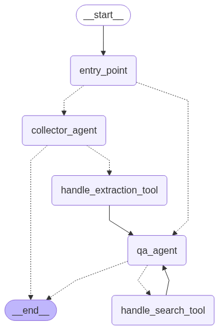

# 🏥 Medical Services ChatBot - LangGraph RAG System

## Overview

An intelligent Hebrew/English bilingual chatbot for Israeli Health Maintenance Organizations (HMOs) that provides personalized medical service information using RAG (Retrieval-Augmented Generation) with LangGraph workflow orchestration.

This project implements a sophisticated conversational AI system that:
- Collects user information through natural conversation
- Builds personalized user profiles 
- Retrieves relevant medical service information from a knowledge base
- Provides tailored answers based on user's HMO and insurance tier
- Maintains stateful conversation sessions with persistent memory

## 🏗️ Architecture & Workflow



The system follows a sophisticated multi-phase architecture:

### Phase 1: Information Collection
- **Entry Point**: User initiates conversation
- **Collector Agent**: Gathers required user information through natural conversation:
  - First and last name (שם פרטי ושם משפחה)
  - National ID (מספר זהות) - 9 digits
  - Gender (מין) - male/female (זכר/נקבה)
  - Date of birth (תאריך לידה)
  - HMO (קופת חולים) - Clalit/Maccabi/Meuhedet (כללית/מכבי/מאוחדת)
  - Insurance tier (תוכנית ביטוח) - Gold/Silver/Bronze (זהב/כסף/ארד)

### Phase 2: Profile Building
- **Handle Extraction Tool**: Processes collected information using structured extraction
- **Profile Validation**: Ensures all required fields are properly captured
- **User Confirmation**: Allows users to verify their profile information

### Phase 3: Q&A Service
- **QA Agent**: Handles medical service inquiries
- **Handle Search Tool**: Retrieves relevant information from the vector database
- **Personalized Responses**: Tailors answers based on user's specific HMO and insurance tier
- **Source Citation**: Always cites source documents for transparency

### Key Components:
- **LangGraph Workflow**: State machine orchestrating conversation flow
- **Vector Search**: FAISS-based similarity search for document retrieval
- **Session Management**: Persistent conversation state across interactions
- **Dual Language Support**: Seamless Hebrew/English conversation handling

## 🎥 Demo Video

**Note**: Due to file size constraints on GitHub, the demo video `example.mov` is not included in this repository and is attached in the email.

The demo video demonstrates the complete chatbot interaction flow:
1. **Initial greeting** and information collection phase
2. **Natural conversation** for gathering user details
3. **Profile confirmation** and validation
4. **Medical service inquiries** with personalized responses
5. **Source citation** and relevant information retrieval

## 🚀 Installation & Setup

### Prerequisites
- Python 3.8+
- Azure OpenAI API access

### 1. Install Dependencies
```bash
pip install -r requirements.txt
```

### 2. Environment Configuration

Create a `.env` file in the project root and add your Azure OpenAI credentials:

```env
# Azure OpenAI Configuration
AZURE_OPENAI_API_KEY=your_azure_openai_api_key_here
AZURE_OPENAI_ENDPOINT=https://your-resource-name.openai.azure.com/
AZURE_OPENAI_API_VERSION=your_azure_openai_api_version
```

**Note**: The `.env` file is not provided in this repository for security reasons. You must create it with your own Azure OpenAI credentials.

#### How to get Azure OpenAI credentials:
1. Create an Azure OpenAI resource in the Azure portal
2. Go to "Keys and Endpoint" section
3. Copy the API key and endpoint URL
4. Ensure you have deployed the required models:
   - `gpt-4o` for chat completion
   - `text-embedding-3-small` for embeddings

### 3. Build Vector Index

Before running the application, build the vector index from the processed medical documents:

```bash
python scripts/build_index.py
```

This script will:
- Process all Markdown files in `data/processed/`
- Generate embeddings using Azure OpenAI
- Create a FAISS vector index
- Save the index to the `indexes/` directory

### 4. Run the Application

```bash
python run.py
```

This will start both:
- **Backend API** on `http://localhost:8000`
- **Frontend UI** on `http://localhost:7860`

## 🌐 Usage

### Web Interface
1. Open `http://localhost:7860` in your browser
2. Start chatting with the bot in Hebrew or English
3. Provide your personal information when requested
4. Ask questions about medical services

## 🔧 Technical Features

### LangGraph Workflow
- **State Machine**: Sophisticated conversation flow management
- **Phase Transitions**: Automatic progression from collection to Q&A
- **Tool Integration**: Structured information extraction and search
- **Error Handling**: Robust error recovery and user guidance

### Vector Database
- **Technology**: FAISS (Facebook AI Similarity Search)
- **Embeddings**: Azure OpenAI text-embedding-3-small
- **Documents**: 10+ medical service documents from Israeli HMOs
- **Chunking**: Recursive character text splitting with overlap
- **Search**: Cosine similarity with normalized embeddings

### Session Management
- **Stateful Conversations**: Persistent session state
- **Memory**: Conversation history and user profile retention
- **Phase Tracking**: Automatic workflow phase management
- **Timeout Handling**: Automatic session cleanup

### Multilingual Support
- **Hebrew/English**: Seamless language detection and response
- **Context Awareness**: Maintains conversation language preference

## 🎯 Key Features

### Conversational Intelligence
- **Natural Flow**: Human-like conversation patterns
- **Context Retention**: Remembers previous exchanges
- **Smart Validation**: Intelligent field validation and error correction
- **Adaptive Responses**: Adjusts based on user input quality

### Personalization Engine
- **HMO-Specific**: Tailored responses for Clalit, Maccabi, Meuhedet
- **Tier-Aware**: Considers Gold/Silver/Bronze insurance levels
- **Demographic Factors**: Age and gender-appropriate recommendations
- **Cultural Sensitivity**: Hebrew-first approach with English support

### Information Retrieval
- **Semantic Search**: Understanding beyond keyword matching
- **Source Attribution**: Always cites information sources
- **Relevance Filtering**: Only returns pertinent information
- **Real-time Processing**: Fast response times with caching

### Developer Experience
- **Debug Mode**: Detailed workflow execution logging
- **API Documentation**: Comprehensive OpenAPI/Swagger docs
- **Modular Design**: Easy to extend and modify
- **Error Reporting**: Detailed error messages and recovery

## 🔍 Troubleshooting

### Common Issues

#### 1. Azure OpenAI Authentication Error
```
Error: Azure OpenAI authentication failed
```
**Solution**: Verify your `.env` file has correct `AZURE_OPENAI_API_KEY` and `AZURE_OPENAI_ENDPOINT`

#### 2. Vector Index Not Found
```
Error: Vector store not found!
```
**Solution**: Run `python scripts/build_index.py` to build the vector index

#### 3. Missing Dependencies
```
ModuleNotFoundError: No module named 'X'
```
**Solution**: Run `pip install -r requirements.txt`

#### 4. Session Store Errors
```
Error: Services directory not found!
```
**Solution**: Ensure the `services/` directory exists with all required files

### Performance Optimization

- **Vector Index**: Rebuild index if search quality degrades
- **Session Cleanup**: Regular cleanup of expired sessions
- **Caching**: Enable response caching for repeated queries
- **Rate Limiting**: Implement rate limiting for production use

## 📊 Technology Choices & Justification

### LangGraph
- **Reasoning**: Provides sophisticated state management for complex conversational flows
- **Benefits**: Visual workflow design, debugging capabilities, modular agent architecture
- **Alternative**: LangChain chains (less flexible for multi-phase conversations)

### FAISS Vector Database
- **Reasoning**: High-performance similarity search with minimal setup
- **Benefits**: Local deployment, no external dependencies, excellent performance
- **Alternative**: Pinecone (cloud-based, additional cost), Chroma (good for prototyping)

### Azure OpenAI
- **Reasoning**: Enterprise-grade reliability and compliance
- **Benefits**: High-quality embeddings and chat completion, Hebrew language support
- **Alternative**: OpenAI API (less compliance features), HuggingFace (self-hosted)

### FastAPI + Gradio
- **Reasoning**: Rapid development with production-ready performance
- **Benefits**: Automatic API documentation, async support, simple UI development
- **Alternative**: Flask + React (more complex), Streamlit (less flexible)
